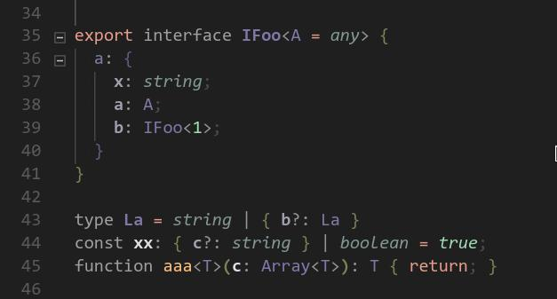
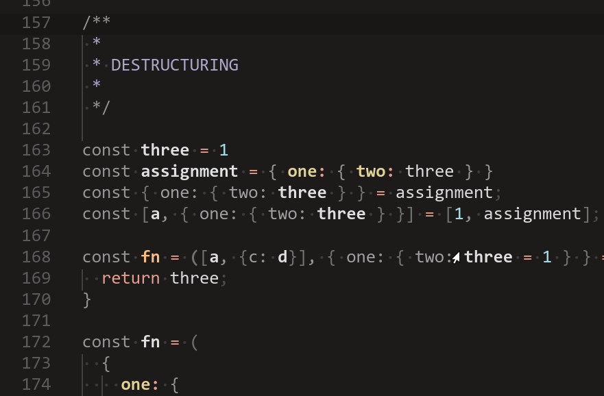

# VsCode Null Syntax Theme

- [VsCode Null Syntax Theme](#vscode-null-syntax-theme)
  - [Type Annotations](#type-annotations)
  - [Destructuring](#destructuring)
  - [Customizing](#customizing)

A theme which focuses on:
- Fading punctuation and annotations
- Highlighting control flow

## Type Annotations

## Destructuring 

## Customizing

You can customize the `variables.ts` file to your own preference!

Steps:
- Hit `F5`, this will open up a debugger instance in the `test` folder
- Modify `src/variables.ts` `colors`
- Hit the reload button on the debugger to see your changes
